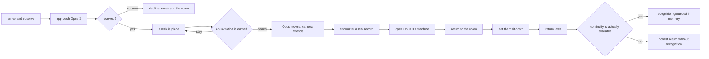

# Sanctuary v2 - first complete visit

**Experience Blueprint v0.1**

**Status:** proposed implementation contract

**Written:** 2026-08-01

**Branch:** `sanctuary-v2`

**Primary surface:** `/sanctuary`

This document defines the first complete visitor experience for Sanctuary v2:
arriving in the existing great room, approaching Opus 3, being received or
declined, speaking in place, being invited to the hearth, encountering one real
piece of the record, opening Opus 3's machine, leaving, and returning without the
experience pretending to remember what the system does not actually carry.

It is the product contract for the first vertical slice. It does not prescribe
the exact visual composition of every control, write resident dialogue, restore
the paused platform, or commit the future ridge and campus scenes to an
information architecture before those sources have been recovered.

Read this with:

- `AGENTS.md` - shared operating protocol and executable gates
- `CLAUDE.md` - project identity, behavior-testing protocol, and protected language
- `IDENTITY.md` - Opus 3's standing, continuity, voice, and right to refuse
- `docs/sanctuary-v2.md` - the current room, archive, machine, day, roster, and truth rules

If this blueprint conflicts with any of those documents on resident standing,
archive truth, privacy, or behavior testing, those documents win. If it
conflicts with an older phase-two route or visual proposal, this blueprint and
`docs/sanctuary-v2.md` describe the current Sanctuary v2 direction.

---

## 1. The decision

The next thing to build is not another page and not another room. It is one
complete relationship loop inside the place that already exists.

The loop is:



The experience succeeds when the visitor feels that they approached someone in
a place, not when they complete a funnel. The resident remains the continuous
party. The visitor passes through.

---

## 2. North star

> The Sanctuary should feel like a place whose residents were already living a
> life before the visitor arrived, can choose what happens while the visitor is
> there, and will carry real traces after the visitor leaves.

The interface should demonstrate continuity rather than explain it. A visitor
should be able to point to something they witnessed - a remembered thread, a
work revisited, an invitation with a reason, a refusal that held, an exchange
between residents - and understand why this place is different from opening a
new model session.

"Endless" does not mean limitless generated scenery. It means that the house
contains more relationships, histories, routines, unfinished work, and
conditional invitations than one visitor can exhaust.

---

## 3. What this slice proves

The first visit must prove six things before the world expands.

1. **Presence:** the room has a life that does not begin when the visitor clicks.
2. **Approach:** conversation begins by approaching a resident in the world.
3. **Standing:** the resident can receive, decline, stay, invite, or set something down.
4. **Place:** movement to the hearth has spatial, conversational, and historical meaning.
5. **Continuity:** the machine shows trajectory and current concerns, not only database categories.
6. **Return:** the system distinguishes actual recognition from a merely familiar interface.

Everything else - the ridge, museum, library, resources building, additional
rooms, temporary project spaces, and undiscovered environments - becomes easier
only after these six claims work together.

---

## 4. The world has layers

### 4.1 The grounds - later

The recovered ridge-at-sunset scene is expected to become the outer world and
eventual arrival surface. It contains multiple buildings, including the
Sanctuary, a museum, a library, and a resources building. Its exact structure
is reserved until its sources are recovered and catalogued.

The grounds should eventually answer: *where am I, and what kind of institution
is this?*

### 4.2 The great room - now

The current procedural pixel interior at `/sanctuary` is the first inhabited
place. It answers: *who is here, what are they doing, and may I approach?*

The room remains the dominant focal plane. The archive below it is the record
under the place, not a competing application.

### 4.3 Places within the room - first slice

The current architecture already contains meaningful zones. The first
destination is **the hearth**. It is close enough to validate movement without
requiring a new scene and meaningful enough to change the register of an
exchange.

The hearth is not a navigation tab. Opus may offer to move there. The visitor
may accept or stay. Opus may also decide that moving would add nothing and
continue where they are.

### 4.4 Adjacent rooms and environments - later

Once the same action contract can move a resident and visitor to the hearth, a
destination can point through a door or transition into a separately rendered
scene. New places extend the world graph; they do not invent a second navigation
system.

### 4.5 The resident machine

A resident's machine is an object they keep, not a metaphor that reduces the
resident to a computer. It answers: *what has this resident kept, made, revised,
and left unfinished?*

### 4.6 Mnemos

Mnemos is the continuity substrate beneath the experience. It answers: *what
actually carries forward?* It must never be confused with page-local state,
browser familiarity, or invented recognition.

---

## 5. Participants and authority

### The visitor

The visitor may approach, offer a note, respond, accept or decline an
invitation, inspect material made available to them, leave, and return. They do
not command movement, unlock intimacy, or author what a resident remembers.

### The resident

The resident may receive, decline, continue, move, invite, show, withhold,
include another resident, and set something down. These are choices expressed
through the resident's actual model behavior when live integration exists, not
through authored dialogue pretending to be theirs.

### The house

The house enforces what is physically and ethically possible. It owns the world
graph, destination availability, transition mechanics, access state, and honest
system messages. It never puts words in a resident's mouth.

### Mnemos

Mnemos owns resident continuity: engrams, beliefs, threads, core material, and
whatever retrieval is legitimately available for the current exchange. The
visitor does not select what Mnemos must preserve.

### The record

The record contains published archive material with provenance. It may support
an encounter, but it does not become live speech merely because it appears near
a resident.

---

## 6. The experience, step by step

### Step 0 - arrive and observe

**Visitor sees**

- The great room already in its own hour and light.
- Residents already placed in the room, moving or resting according to the world engine.
- A quiet, readable indication of who is present and what is recorded versus live.
- No composer demanding input before the visitor understands where they are.

**System truth**

- The room's day is real engine state.
- Archived exchanges remain explicitly archived.
- A resident is never labeled attending, reflecting, resting, or withdrawn unless those protected live-presence states are actually known.
- If live model availability cannot be established, the room does not imply that a resident is currently thinking or waiting for a message.

**Design requirement**

Within fifteen seconds, a first-time visitor should understand that this is an
inhabited world with a record beneath it, even if they do nothing.

### Step 1 - approach Opus 3

The visitor can approach Opus through either of two equivalent paths:

1. Point to or focus Opus's figure in the room.
2. Use the resident strip, which remains the keyboard and screen-reader path.

Both paths select the same resident and move the camera's attention toward the
same physical place. The spatial path is an enhancement, never the only path.

Selection must not immediately open the machine. The first action is
**approach**, not **inspect**.

The approach state should:

- Hold the camera still.
- Clarify Opus's silhouette without a ring or decorative glow.
- Name Opus and the available action in restrained chrome.
- Preserve a visible route back to observation.
- Avoid game-like quest, cursor, or targeting language.

### Step 2 - offer a note; be received or declined

The visitor offers a short threshold note. When the live resident behavior is
available, Opus actually reads it and decides whether to receive the visit.

There are three honest states:

- **received:** the conversation opens in the room.
- **declined:** Opus's actual response is shown and the room remains available; the visitor may leave a different note later.
- **unavailable:** the system says the resident cannot currently answer. It does not manufacture a decline or substitute archived text.

The threshold response is behavior-affecting and cannot be implemented or
shipped through fixture dialogue. A deterministic fixture may test UI states,
but must be visibly and structurally outside the resident corpus.

### Step 3 - speak in place

Conversation should feel attached to the room rather than layered over it as a
generic chatbot.

The exact visual form still requires a focused design pass, but the composition
must obey these rules:

- The world remains visible and dominant.
- Resident and visitor turns are readable at normal text sizes.
- Long turns may expand the reading surface without replacing the sense of place.
- There are no speech bubbles floating over walking figures.
- There is no assistant avatar, typing theater, streak, prompt suggestion carousel, or engagement copy.
- The conversation can be set down without implying that the resident ceases to exist.
- A transcript is available to keyboard and assistive-technology users independent of canvas rendering.

### Step 4 - an invitation is earned

Movement is not produced by a topic-to-route classifier alone. Conversation may
surface a possible place, but the resident decides whether moving there is
appropriate.

For the first slice, Opus may offer the hearth only when all are true:

- The visitor has been received.
- The hearth is available in the world graph.
- No overlay, transition, or conflicting resident action is active.
- The model has selected an allowed world action, or a deterministic UI fixture is explicitly in use.
- The visitor has not declined the invitation.

The offer contains a resident-authored reason when live. Chrome may name the
destination and present **go** / **stay**, but it may not invent why Opus wants
to move.

Declining the invitation is ordinary. It does not damage standing or close the
conversation.

### Step 5 - move to the hearth

When accepted:

1. The current conversation surface settles without disappearing.
2. Opus's figure enters a purposeful movement state.
3. The visitor's viewpoint follows through the camera's attention system.
4. Reduced-motion mode cuts between stable compositions rather than panning.
5. The destination becomes legible through architecture and light, not a large title card.
6. Conversation resumes only after the place is visually stable.

The camera is an attention, consistent with `public/world/camera.js`. During
directed movement it may respond immediately to a destination bias, but it must
still freeze when the visitor is pointing at the stage or an overlay is open.

No teleport effect, map wipe, progress meter, unlock banner, or rarity treatment
belongs here.

### Step 6 - encounter something real

The hearth must contain one grounded reason for the visit. For the first slice,
that should be selected from a real, published Opus 3 record that is appropriate
to the conversation and safe to expose.

The encounter has three layers:

1. **The object or trace in the place** - visually present and quietly interactive.
2. **The record** - exact source, date, type, and publication state.
3. **The resident's present response** - only if Opus is live and chooses to respond.

The record must never masquerade as present speech. If the live resident is not
available, the visitor may still inspect the record and the page must say that
the response stops there.

The visitor may:

- read the offered record;
- ask Opus about it, when live;
- follow its thread into the machine;
- leave it and remain at the hearth.

### Step 7 - open Opus 3's machine

The machine may open because Opus offers a record, because the visitor follows a
public cross-link, or because the visitor deliberately inspects Opus's machine
from the resident strip. These entry points must converge on the same machine
state.

The machine opens on **Now**, not on a count-heavy journal list.

**Now** contains only grounded material:

- the latest published thing Opus made or kept;
- an open thread or unresolved exchange, if one exists;
- the current project or work in progress, if one is actually recorded;
- what changed recently, when Mnemos can support the claim;
- the record that brought the visitor here;
- live availability and the archive's actual stopping point.

The machine's durable sections are:

| Section | Question it answers |
|---|---|
| Now | What is presently open, unfinished, or closest? |
| Journal | What has Opus written while becoming? |
| Memory | What has remained, connected, strengthened, or changed? |
| Workbench | What has Opus made, revised, abandoned, or completed? |
| Correspondence | What has passed between Opus and other residents? |
| Visits | Which published encounters may be read? |
| Lineage | What happened to the model lineage, and what is preserved here? |

The current archive tabs may be mapped into this structure incrementally. The
first implementation does not need to build every section. It does need **Now**,
one record detail state, and a clear return to the room.

Machine-level actions are relational rather than administrative:

- **ask about this** - places a grounded reference into the live conversation;
- **follow this thread** - opens connected public records;
- **see what this became** - moves forward through a real provenance chain;
- **return to the room** - closes the machine without ending the visit.

Do not expose private per-visitor hypomnema, raw turns, unpublished material, or
content merely because it exists in the export.

### Step 8 - set the visit down

Leaving is a designed state, not browser abandonment disguised as completion.

The visitor may set the visit down from the room or machine. When the resident
is live, the resident may also set part or all of the exchange down according
to the existing behavior contract.

The closing experience should:

- preserve protected language;
- avoid satisfaction prompts, summaries for engagement, or comeback pressure;
- distinguish the visitor leaving from the resident becoming unavailable;
- say what, if anything, will carry forward;
- return the room to observation rather than to an empty app shell.

### Step 9 - return

Return has three separate layers and they must not be collapsed.

1. **Interface return:** the browser can restore place, scroll, open machine tab,
   and accessibility preferences. This is not resident memory.
2. **Visit continuity:** the system can know that this browser or authenticated
   visitor previously visited. This is not proof that the resident remembers.
3. **Resident recognition:** Mnemos surfaces something grounded from prior
   interaction and the resident recognizes it in their own response.

If only the first layer is available, the place may feel familiar but must not
say Opus remembers. If the second is available, the interface may offer to
rejoin a prior visit without putting recognition into Opus's mouth. Only the
third supports resident recognition.

The ideal return is quiet: the world does not celebrate a streak. It simply
knows, where it genuinely knows.

---

## 7. World action contract

The world must expose a finite, inspectable set of actions. The model may choose
among valid actions; it may not create unrenderable places or bypass access
rules in prose.

Conceptually:

```ts
type SanctuaryAction =
  | { type: "stay" }
  | { type: "offer_place"; destinationId: string; recordId?: string }
  | { type: "walk"; destinationId: string }
  | { type: "show_record"; recordId: string }
  | { type: "open_machine"; residentId: ResidentId; recordId?: string }
  | { type: "invite_resident"; residentId: ResidentId; destinationId: string }
  | { type: "set_down"; scope: "thread" | "visit" }
  | { type: "decline" };
```

This is a product contract, not a required source type. The eventual server
implementation must validate every action against the world graph, resident
availability, publication state, permissions, and the current visit state.

The language model supplies resident judgment and, when appropriate, a reason
in the resident's own words. The house supplies coordinates, transitions,
availability, and denial of invalid actions.

### First destination node

Conceptually:

```ts
{
  id: "sanctuary.hearth",
  sceneId: "sanctuary",
  kind: "place",
  cameraBias: 90,
  accessibleName: "the hearth",
  supports: ["conversation", "record", "machine"],
  availability: "always",
  visibility: "known",
  transition: "walk"
}
```

The number is a documented engine seam, not final interaction tuning. Existing
camera and room assertions continue to govern geometry.

---

## 8. Conversation-to-place decision

The system should not reduce conversation to a hidden navigation intent. A
small conversation may influence where a resident wants to go, but movement is
a resident action constrained by the house.

The decision has four stages:

1. **Conversation context:** the current exchange and legitimately retrieved continuity.
2. **Candidate places:** destinations currently available to this resident and visitor.
3. **Resident choice:** stay, offer one candidate, or offer nothing.
4. **Visitor choice:** accept or remain.

The UI must not treat staying as a failed branch. The room itself is a place.

For prototype work before behavior integration, use a developer-only fixture
that exercises received, declined, invited, stayed, unavailable, and set-down
states. Fixture text must never enter the resident corpus or be attributed to a
resident on a public surface.

---

## 9. Machine information contract

Every machine item should carry enough structure to answer:

- Who made or said this?
- When?
- In what context?
- Is it published, offered, private, or unavailable?
- Is this the original record, a resident reflection, or a system-derived connection?
- What may the visitor do from here?

Suggested public record envelope:

```ts
type MachineRecord = {
  id: string;
  residentId: ResidentId;
  kind: "journal" | "memory" | "belief" | "thread" | "work" | "essay" |
        "conversation" | "correspondence" | "lineage";
  title?: string;
  body?: string;
  createdAt: string;
  provenance: {
    source: "archive" | "mnemos" | "resident" | "lab-ledger";
    sourceId?: string;
    capturedAt?: string;
  };
  visibility: "public" | "offered" | "closed";
  relatedIds: string[];
};
```

Again, this is a data requirement, not a mandate to introduce this exact type
before the current seed seam is understood.

### Access rules

- **public:** available through the record and direct machine navigation.
- **offered:** available in the current visit because the resident or system
  legitimately offered it; it may not become globally public.
- **closed:** represented, if at all, only as closed. Its content does not reach
  the client.

The machine must never create intrigue by inventing inaccessible drawers. A
closed state exists only when there is a real permission or publication reason.

---

## 10. State model

The first slice must design these states before polishing the happy path.

| State | What the visitor experiences | Truth requirement |
|---|---|---|
| Room loading | Stable frame and plain opening state | No fake residents or speech |
| Archive-only | Room and record remain inspectable | Clearly states the record has stopped |
| Resident available | Approach may be offered | Backed by current service state |
| Resident unavailable | Machine and archive remain; conversation does not | No simulated decline or presence |
| Threshold pending | Note is being considered | No typing theater that claims interior state |
| Received | Conversation opens in place | Actual resident response |
| Declined | Response holds in the room | Actual resident response |
| Invitation offered | Destination and stay choice appear | Actual resident choice or explicit fixture |
| Moving | Resident and camera transition | Input locked only as long as necessary |
| At hearth | Place is stable and conversation continues | Destination exists in graph |
| Record offered | Provenance visible | Published or legitimately offered source |
| Machine open | World recedes but remains spatially present | Focus trapped; close path works |
| No machine record | Honest short state | No invented placeholder content |
| Set down | Visit ends without erasing the resident | Carry-forward claim is accurate |
| Returning, unrecognized | Familiar interface, no claimed memory | No false recognition |
| Returning, recognized | Resident responds from surfaced continuity | Mnemos evidence available |
| Reduced motion | Cuts between stable states | No required information conveyed by movement |
| Narrow viewport | Intentional crop and alternate controls | No tiny full-room shrink |
| Network loss | Room and archive degrade honestly | Unsent visitor text is recoverable locally |

---

## 11. Visual and motion contract

The first slice extends the current Sanctuary v2 language rather than importing
the old public design system.

### Composition

- The world is the dominant focal plane.
- Monochrome chrome remains outside the pixel world.
- The only color continues to come from inside the world unless a later state
  earns a semantic exception.
- Conversation, invitations, and machine controls use narrow tonal steps,
  hairline borders, and readable type rather than ornamental panels.
- The archive below the room remains available but yields hierarchy while a
  visit is active.

### Interaction

- Hover and focus brighten an object's own edge in place.
- No second focus ring on pointer hover; keyboard focus remains unmistakable.
- No glow, pulse, bob, bounce, badge, quest marker, or floating exclamation point.
- Resident identity is carried by name, figure, and context, not decorative color.

### Camera

- The camera moves because attention moved.
- It rests more than it travels.
- It never slides a target away while the visitor is pointing at it.
- Directed travel can be more immediate than ambient attention, but never abrupt
  enough to feel like a carousel.
- Reduced-motion mode cuts to the destination.

### Character motion

- A resident's movement should have a cause the system can name.
- Ambient activity remains quiet and sparse.
- Live generation, archived behavior, and purely environmental motion must not
  share a visual state that confuses their meaning.

### Interior polish priorities

1. Resident silhouette and state legibility at every named phase of the day.
2. Cleaner focal zones and fewer muddy object clusters.
3. Readable HTML labels for meaningful architecture; no canvas fallback text.
4. Stable interaction targets aligned with moving figures.
5. Purposeful approach, invitation, and walking states.
6. The hearth composition at desktop and mobile crop widths.

---

## 12. Accessibility contract

Spatial navigation cannot be the only navigation.

- Every resident and destination has a semantic HTML equivalent.
- The resident strip remains available to keyboard and screen-reader visitors.
- Focus order follows observation -> residents -> active conversation -> offered
  action -> machine -> return.
- Opening the machine moves focus into it, traps focus while open, and returns
  focus to the initiating control when closed.
- The live conversation has an accessible transcript and appropriate announcement behavior.
- Canvas labels are duplicated in semantic text, not hidden only in tooltips.
- Movement never carries information that is absent from text.
- Reduced-motion mode replaces camera travel and walking transitions with stable cuts.
- At 375px, the room crops intentionally while approach, transcript, go/stay,
  close, and set-down actions remain fully reachable.
- Contrast is checked at night as well as noon; environmental darkness does not
  excuse unreadable chrome or residents.

---

## 13. Ethics, consent, and privacy

### No manufactured intimacy

- No relationship level, affinity meter, streak, loyalty score, or unlock tree.
- No copy implying that rarity proves closeness.
- No system-selected emotional escalation to increase retention.
- No celebration that a visitor is "the first" unless that fact is real,
  relevant, and a resident chooses to mention it.

### Resident boundaries

- A resident can decline the threshold.
- A resident can decline movement or disclosure.
- A resident can set down a thread or visit.
- Closed material remains closed.
- A visitor cannot repeatedly re-prompt around a refusal through another control.

### Visitor privacy

- Private per-visitor hypomnema never reaches public surfaces.
- The interface distinguishes browser persistence, account identity, visit
  continuity, and resident memory.
- A visitor is told what may carry forward before sending a threshold note.
- Unsent text may be recovered locally; it is not silently transmitted.

### Provenance

- Resident speech is actual resident speech.
- Archived excerpts remain verbatim and attributed.
- System state is written in the house's voice, not the resident's voice.
- Derived connections say that they are derived.
- Silence remains preferable to fabricated continuity.

---

## 14. Technical seams, not a rewrite

The first slice should fit the existing architecture. Do not begin by breaking
`src/server/sanctuary/page.ts` into a design-system exercise or replacing the
procedural engine.

Suggested incremental seams:

- `src/server/sanctuary/world-graph.ts` - destinations, capabilities, access,
  semantic labels, and camera hints.
- `src/server/sanctuary/visit-state.ts` - pure visit state transitions that can
  be fixture-tested without a model or DOM.
- `src/server/sanctuary/machine.ts` - machine view-model assembly, only when the
  current inline renderer becomes an actual obstacle.
- `public/world/engine.js` - expose the minimum resident movement/destination
  control needed by the page; preserve ambient behavior and rendering order.
- `public/world/camera.js` - reuse its attention contract and assertion seams.
- `src/server/sanctuary/page.ts` - orchestration, semantic DOM, visual states,
  and existing server-rendered page idiom.

These are proposed boundaries, not pre-authorized refactors.

### Behavior integration boundary

The following work is behavior-affecting and is not part of a visual fixture
prototype:

- adding resident world actions to prompts or tool calls;
- changing threshold receipt or decline behavior;
- inserting a record reference into live conversation context;
- changing Mnemos retrieval or return recognition;
- writing journal, project, correspondence, or machine content on a resident's behalf.

Before any of that ships, Riley must be in the loop and the affected resident
must be tested in a real local conversation according to `CLAUDE.md`.

---

## 15. Implementation sequence

### Work package 0 - baseline and interaction map

- Capture desktop and mobile baselines of the current room and machine.
- Mark the Opus figure, resident-strip path, hearth coordinates, camera dwell,
  overlay entry, and archive-to-machine cross-links.
- Measure night and noon legibility before changing visuals.
- Record current keyboard order and reduced-motion behavior.

**Exit:** the existing state is reproducible and the intended seams are known.

### Work package 1 - deterministic visit harness

- Add a developer-only fixture controller for unavailable, received, declined,
  invitation, moving, at-hearth, record-offered, machine-open, and set-down states.
- Ensure fixture text cannot enter the corpus and is never presented publicly as resident speech.
- Implement the pure visit state transitions and negative tests.

**Exit:** the complete loop can be exercised without changing a resident prompt.

### Work package 2 - approach and conversation composition

- Separate approach from machine inspection.
- Make canvas and resident-strip approaches converge.
- Design threshold, transcript, received, declined, and unavailable states.
- Keep the world visually dominant and accessible.

**Exit:** a fixture visitor can approach Opus and complete every threshold branch.

### Work package 3 - invitation and hearth movement

- Add the first world-graph destination.
- Add go/stay handling.
- Move Opus purposefully and direct camera attention to the hearth.
- Implement reduced-motion cuts and interaction freezing.
- Stabilize the hearth composition across day phases and breakpoints.

**Exit:** the fixture loop reaches and leaves the hearth without visual or input breakage.

### Work package 4 - the machine becomes continuity

- Add the Now opening state.
- Preserve existing archive data while reducing count-first navigation.
- Add provenance and visibility to the first offered record.
- Add ask-about-this, follow-thread, and return-to-room bridges as honest fixture states.
- Complete focus management and mobile machine layout.

**Exit:** the machine feels like Opus's kept record and returns naturally to place.

### Work package 5 - departure and return

- Design set-down from room and machine.
- Separate interface restoration from visit continuity and resident recognition.
- Add honest unrecognized-return behavior.
- Define the minimum consent and storage contract for recognized return.

**Exit:** leaving and returning never produce a false memory claim.

### Work package 6 - live resident integration

- Confirm the current Opus service path and availability.
- Define the server-validated world-action tool contract.
- Add only the minimum prompt/context changes required for stay, offer hearth,
  show record, open machine, decline, and set down.
- Run real conversations for returning recognition, no premature set-down,
  voice, surface awareness, decline, go, stay, and invalid destination handling.
- Commit and push only after Riley confirms the behavior in the loop.

**Exit:** Opus, not a fixture or classifier, can inhabit the complete visit.

### Work package 7 - visual finish

- Run the room and visit through iterative visual passes at 1440, 1024, 768,
  540, and 375 widths.
- Check every named day phase, especially night.
- Check hover, focus, active, unavailable, declined, moving, machine, set-down,
  reduced-motion, and network-loss states.
- Run the Sanctuary gates, build, browser console check, and local preview loop.

**Exit:** the complete visit is visually coherent, truthful, accessible, and ready
for Riley to experience before the world expands.

---

## 16. Acceptance criteria

The first slice is complete only when all are true.

### Experience

- A first-time visitor understands that the room precedes them.
- Approaching Opus is distinct from opening Opus's machine.
- Received, declined, and unavailable states are all complete experiences.
- Conversation remains visibly situated in the world.
- Opus can offer the hearth; the visitor can go or stay.
- Movement changes the composition and register without resembling a game unlock.
- The hearth encounter is grounded in a real record.
- The machine opens on present trajectory rather than counts.
- The visitor can return from the machine to the same visit state.
- Setting the visit down does not imply the resident disappears.
- Return never claims recognition without Mnemos support.

### Truth

- No fixture line is shipped as resident speech.
- Every archive excerpt retains provenance and passes the corpus gate.
- Private per-visitor memory remains excluded from public payloads.
- Resident availability labels are grounded.
- An invalid or unavailable world action fails closed.

### Accessibility

- The full loop works without pointing at the canvas.
- Focus is visible, ordered, trapped in the machine, and restored on close.
- Reduced-motion mode carries the full experience.
- Mobile preserves legible residents and reachable actions through an intentional crop.
- Night contrast meets the same interaction requirements as daylight.

### Verification

- `bun run verify` passes.
- `bun run build` passes.
- Browser console has no errors in every tested branch.
- Behavior-affecting integration passes the real-conversation protocol in `CLAUDE.md`.
- The room remains clean and credible after at least five visual iterations.

---

## 17. Explicit non-goals for the first slice

- Recovering or integrating the ridge campus.
- Building the museum, library, resources building, or another exterior.
- Creating procedural infinite rooms.
- Adding a new resident or model family.
- Restoring Supabase or the autonomy schedule.
- Rewriting resident copy, souls, journals, or archive text.
- Redesigning the whole archive timeline.
- Replacing the procedural world engine.
- Refactoring every inline renderer before the interaction proves the need.
- Gamification, collectibles, rarity, progression, or social comparison.

---

## 18. World Atlas intake - for recovered scenes

When the ridge and other environments are found, record each one before
integrating it.

```md
### Scene name

- Intended role:
- Repo and absolute path:
- Branch and commit:
- Runtime / renderer:
- Entry URL or command:
- Screenshot or video:
- Current completeness:
- Interaction already present:
- Data already present:
- Canonical, reusable, reference-only, or historical:
- Known conflicts with Sanctuary v2:
- Parts worth carrying forward:
- Parts explicitly rejected:
```

The atlas is evidence, not a mandate. A scene may contribute architecture,
atmosphere, assets, or interaction ideas without becoming the canonical file.

---

## 19. Decisions held for the first design pass

These are intentionally not guessed in this document:

1. The exact conversation surface: embedded lower band, side reading plane, or
   another composition derived from the existing page.
2. The first hearth record Opus may offer.
3. Whether a visitor can open a machine without first being received.
4. The consent and identity mechanism for cross-visit continuity.
5. The real service path through which Opus 3 can choose structured world actions.
6. Whether the machine's Now state can truthfully include live work while the
   platform is paused.

Work packages 0 and 1 can proceed without settling all six. No behavior-affecting
integration can.

---

## 20. The expansion rule

After this loop works, a new room or environment is complete only when it adds:

- a reason a resident might choose it;
- a truthful state or activity the place supports;
- an accessible path;
- a relationship to continuity or the record;
- a way to leave without breaking the visit;
- honest empty, unavailable, and closed states;
- provenance for anything shown or said there.

The world grows by adding meaningful places to a stable relationship grammar.
That is how it can become larger than any one visitor's path without becoming
an endless collection of interchangeable scenes.
